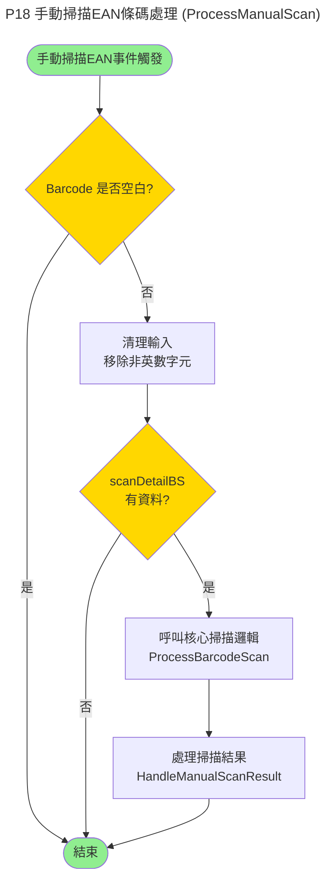
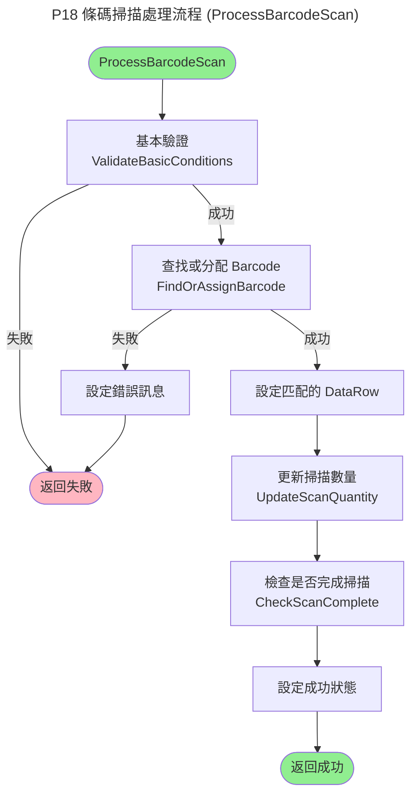
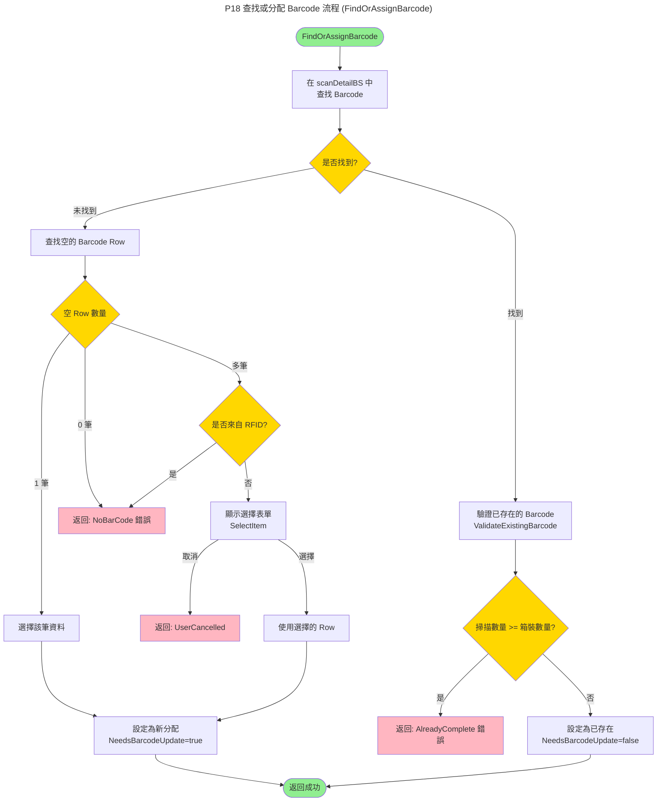
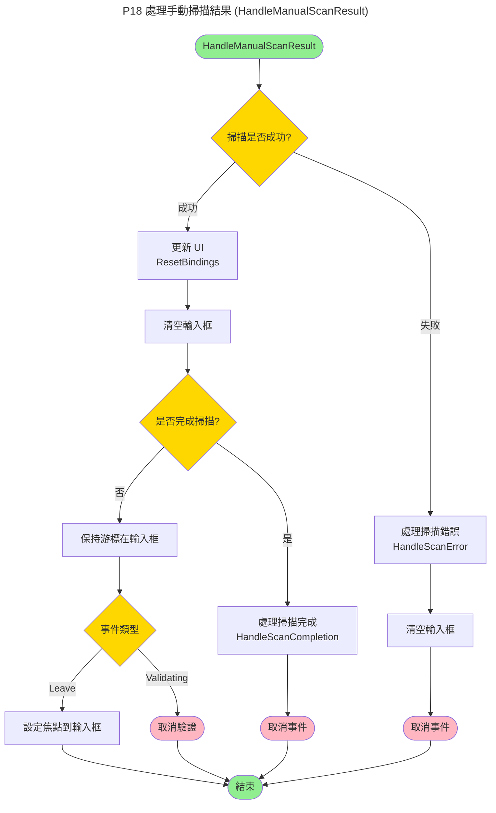
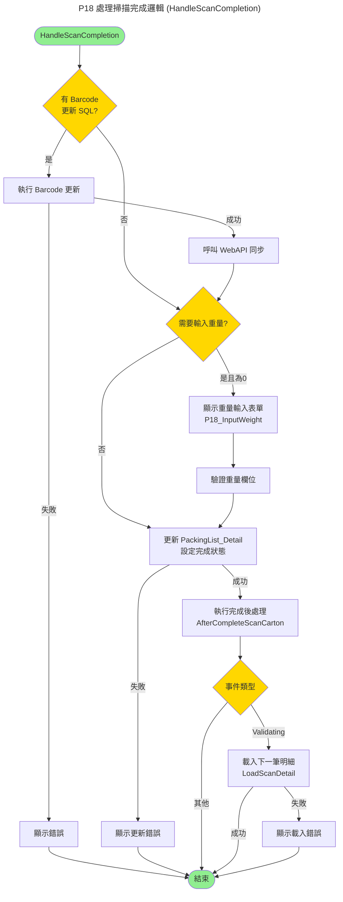
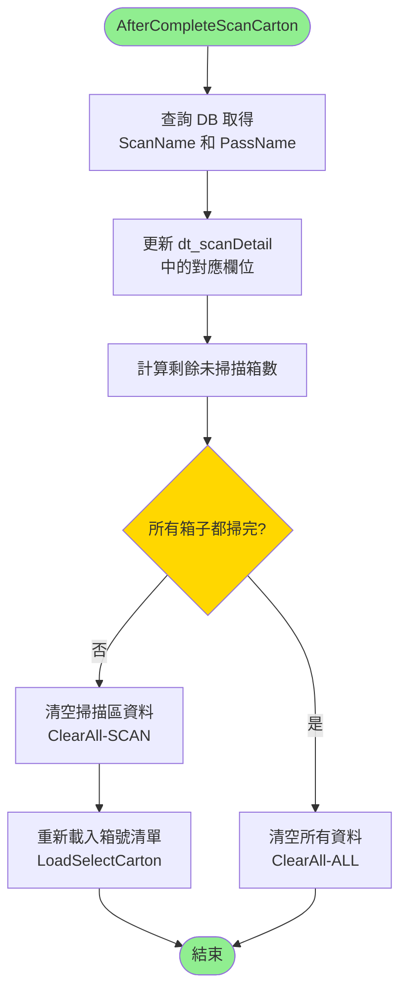

## 第三部分：條碼掃描流程（核心業務邏輯）

```mermaid
---
title: P18 手動掃描EAN條碼處理 (ProcessManualScan)
---
flowchart TD
    Start([手動掃描EAN事件觸發]) --> CheckEmpty{Barcode 是否空白?}
    CheckEmpty --> |是|End([結束])
    CheckEmpty --> |否|CleanInput[清理輸入<br/>移除非英數字元]
    
    CleanInput --> CheckDataSource{scanDetailBS<br/>有資料?}
  CheckDataSource --> |否|End
    CheckDataSource --> |是|CallCore[呼叫核心掃描邏輯<br/>ProcessBarcodeScan]
    
 CallCore --> HandleResult[處理掃描結果<br/>HandleManualScanResult]
    HandleResult --> End

    style Start fill:#90EE90
    style End fill:#90EE90
    style CheckEmpty fill:#FFD700
    style CheckDataSource fill:#FFD700
```

```mermaid
---
title: P18 條碼掃描處理流程 (ProcessBarcodeScan)
---
flowchart TD
    Start([ProcessBarcodeScan]) --> ValidateBasic[基本驗證<br/>ValidateBasicConditions]
    ValidateBasic --> |失敗|ReturnFail([返回失敗])
    ValidateBasic --> |成功|FindBarcode[查找或分配 Barcode<br/>FindOrAssignBarcode]
    
    FindBarcode --> |失敗|SetError[設定錯誤訊息]
    FindBarcode --> |成功|SetMatchRow[設定匹配的 DataRow]
    
    SetError --> ReturnFail
    SetMatchRow --> UpdateQty[更新掃描數量<br/>UpdateScanQuantity]
    UpdateQty --> CheckComplete[檢查是否完成掃描<br/>CheckScanComplete]
    CheckComplete --> SetSuccess[設定成功狀態]
    SetSuccess --> ReturnSuccess([返回成功])

    style Start fill:#90EE90
    style ReturnSuccess fill:#90EE90
    style ReturnFail fill:#FFB6C1
```

```mermaid
---
title: P18 查找或分配 Barcode 流程 (FindOrAssignBarcode)
---
flowchart TD
    Start([FindOrAssignBarcode]) --> FindPos[在 scanDetailBS 中<br/>查找 Barcode]
    FindPos --> CheckFound{是否找到?}
    
    CheckFound --> |未找到|FindEmpty[查找空的 Barcode Row]
    CheckFound --> |找到|ValidateExist[驗證已存在的 Barcode<br/>ValidateExistingBarcode]
    
    FindEmpty --> CheckEmptyCount{空 Row 數量}
    CheckEmptyCount --> |0 筆|ReturnNoBarcode[返回: NoBarCode 錯誤]
    CheckEmptyCount --> |1 筆|SelectFirst[選擇該筆資料]
    CheckEmptyCount --> |多筆|CheckRFID{是否來自 RFID?}
    
    CheckRFID --> |是|ReturnNoBarcode
    CheckRFID --> |否|ShowSelectForm[顯示選擇表單<br/>SelectItem]
    
    ShowSelectForm --> |取消|ReturnCancel[返回: UserCancelled]
    ShowSelectForm --> |選擇|SelectRow[使用選擇的 Row]
    
    SelectFirst --> SetNew[設定為新分配<br/>NeedsBarcodeUpdate=true]
    SelectRow --> SetNew
    SetNew --> ReturnSuccess([返回成功])
    
    ValidateExist --> CheckQty{掃描數量 >= 箱裝數量?}
    CheckQty --> |是|ReturnComplete[返回: AlreadyComplete 錯誤]
    CheckQty --> |否|SetExist[設定為已存在<br/>NeedsBarcodeUpdate=false]
    SetExist --> ReturnSuccess

    style Start fill:#90EE90
    style ReturnSuccess fill:#90EE90
    style ReturnNoBarcode fill:#FFB6C1
    style ReturnCancel fill:#FFB6C1
    style ReturnComplete fill:#FFB6C1
    style CheckFound fill:#FFD700
    style CheckEmptyCount fill:#FFD700
    style CheckRFID fill:#FFD700
    style CheckQty fill:#FFD700
```

```mermaid
---
title: P18 處理手動掃描結果 (HandleManualScanResult)
---
flowchart TD
    Start([HandleManualScanResult]) --> CheckSuccess{掃描是否成功?}
    
    CheckSuccess --> |失敗|HandleError[處理掃描錯誤<br/>HandleScanError]
    CheckSuccess --> |成功|UpdateUI[更新 UI<br/>ResetBindings]
    
    HandleError --> ClearText[清空輸入框]
    ClearText --> CancelEvent([取消事件])
    
    UpdateUI --> ClearInput[清空輸入框]
    ClearInput --> CheckComplete{是否完成掃描?}
    
    CheckComplete --> |是|HandleComplete[處理掃描完成<br/>HandleScanCompletion]
    CheckComplete --> |否|KeepFocus[保持游標在輸入框]
    
    HandleComplete --> CancelComplete([取消事件])
    KeepFocus --> CheckEventType{事件類型}
    
    CheckEventType --> |Leave|SetFocus[設定焦點到輸入框]
CheckEventType --> |Validating|CancelValid([取消驗證])
    
    SetFocus --> End([結束])
    CancelValid --> End
    CancelComplete --> End
 CancelEvent --> End

    style Start fill:#90EE90
    style End fill:#90EE90
    style CancelEvent fill:#FFB6C1
 style CancelComplete fill:#FFB6C1
    style CancelValid fill:#FFB6C1
    style CheckSuccess fill:#FFD700
style CheckComplete fill:#FFD700
    style CheckEventType fill:#FFD700
```

```mermaid
---
title: P18 處理掃描完成邏輯 (HandleScanCompletion)
---
flowchart TD
    Start([HandleScanCompletion]) --> CheckBarcodeSQL{有 Barcode<br/>更新 SQL?}
    
    CheckBarcodeSQL --> |是|UpdateBarcode[執行 Barcode 更新]
  CheckBarcodeSQL --> |否|CheckWeight
    
  UpdateBarcode --> |成功|CallAPI[呼叫 WebAPI 同步]
    UpdateBarcode --> |失敗|ShowError[顯示錯誤]
    
    ShowError --> ReturnEnd([結束])
    CallAPI --> CheckWeight{需要輸入重量?}
  
    CheckWeight --> |是且為0|ShowWeightForm[顯示重量輸入表單<br/>P18_InputWeight]
    CheckWeight --> |否|UpdatePacking
    
    ShowWeightForm --> ValidateWeight[驗證重量欄位]
    ValidateWeight --> UpdatePacking[更新 PackingList_Detail<br/>設定完成狀態]
  
    UpdatePacking --> |失敗|ShowUpdateError[顯示更新錯誤]
 UpdatePacking --> |成功|AfterComplete[執行完成後處理<br/>AfterCompleteScanCarton]
    
    ShowUpdateError --> ReturnEnd
    AfterComplete --> CheckEventType{事件類型}
    
    CheckEventType --> |Validating|LoadNext[載入下一筆明細<br/>LoadScanDetail]
    CheckEventType --> |其他|ReturnEnd
    
    LoadNext --> |失敗|ShowLoadError[顯示載入錯誤]
    LoadNext --> |成功|ReturnEnd
    
    ShowLoadError --> ReturnEnd

    style Start fill:#90EE90
    style ReturnEnd fill:#90EE90
    style CheckBarcodeSQL fill:#FFD700
    style CheckWeight fill:#FFD700
    style CheckEventType fill:#FFD700
```

---
title: P18 完成掃描後處理 (AfterCompleteScanCarton)
---

```mermaid
flowchart TD
    Start([AfterCompleteScanCarton]) --> QueryDB[查詢 DB 取得<br/>ScanName 和 PassName]
  QueryDB --> UpdateDT[更新 dt_scanDetail<br/>中的對應欄位]
    UpdateDT --> CountRemain[計算剩餘未掃描箱數]
    CountRemain --> CheckAllComplete{所有箱子都掃完?}
    
    CheckAllComplete --> |是|ClearAll[清空所有資料<br/>ClearAll-ALL]
    CheckAllComplete --> |否|ClearScan[清空掃描區資料<br/>ClearAll-SCAN]
    
    ClearScan --> ReloadCarton[重新載入箱號清單<br/>LoadSelectCarton]
    ReloadCarton --> End([結束])
    ClearAll --> End

    style Start fill:#90EE90
    style End fill:#90EE90
    style CheckAllComplete fill:#FFD700
```
